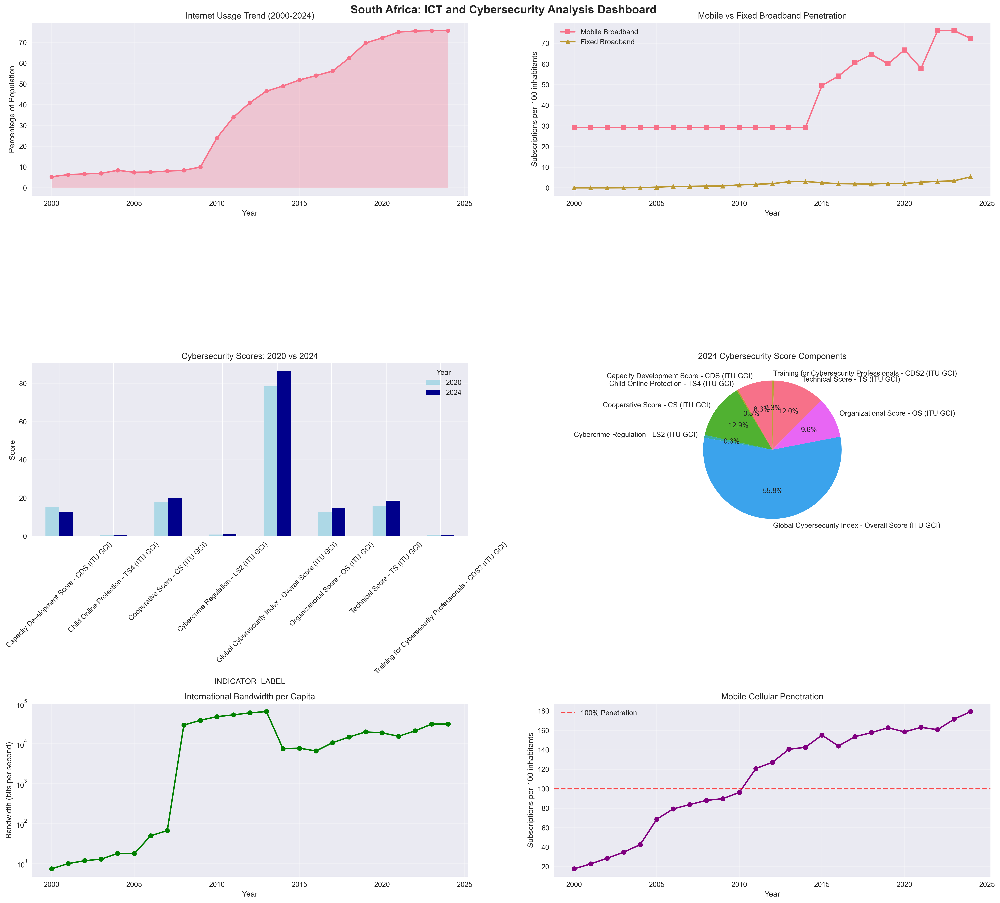
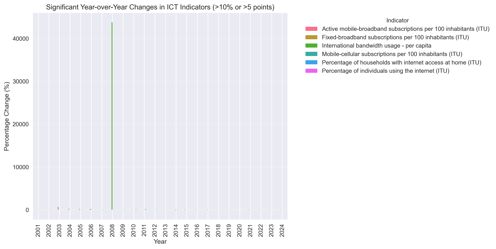

# 📊 SA Dashboard – NDTA631 Group Assignment

## 👥 Group Members
- Hope Mnguni (202203558)  
- Gomolemo Walaza (202200387)  
- Gift Nemakonde (202304063)  
- Keotshepile Modise (202321837)  
- Ikho Nogemane (202301434)  

---

## 📝 Project Summary
This project focuses on **South Africa's Digital Growth and Cybersecurity Readiness**.  
We created an interactive dashboard to explore key metrics, trends, and visualizations that support data-driven insights.  
Users can filter data, view interactive charts, and analyze the year-on-year changes in various digital and cybersecurity indicators.  

---

## 📸 Screenshots
Here are some snapshots of our dashboard:  

  
  

---

## 🎥 Demo Video
Watch our dashboard in action:  

<video src="dashboard.mp4" controls width="700"></video>

---
